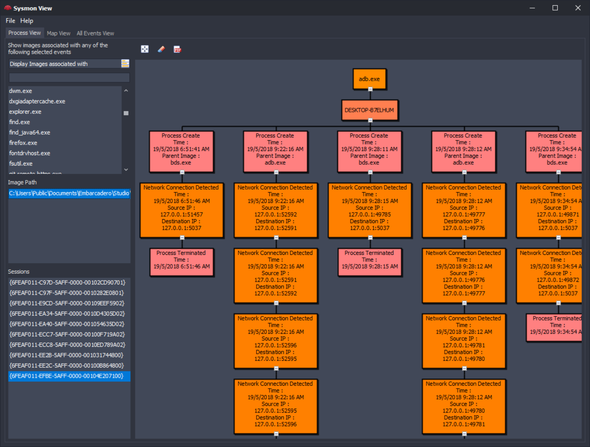
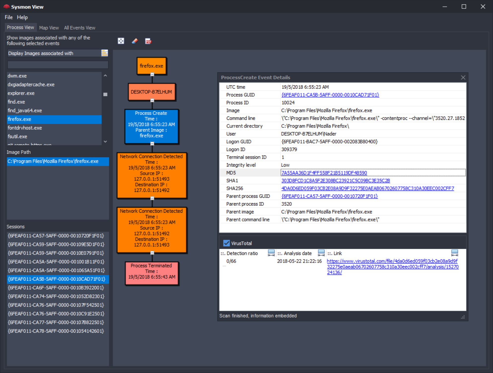
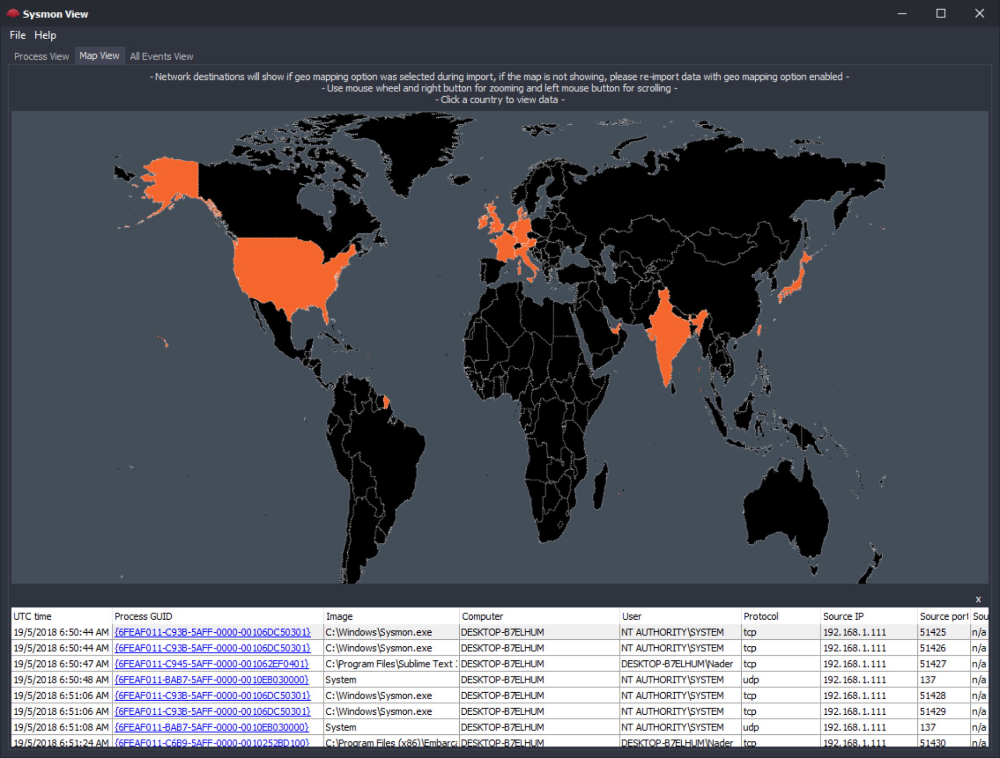
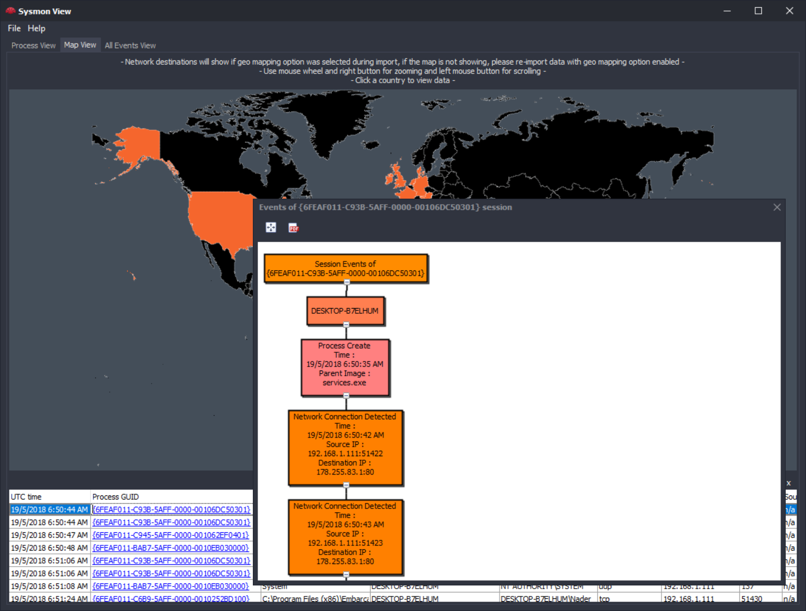
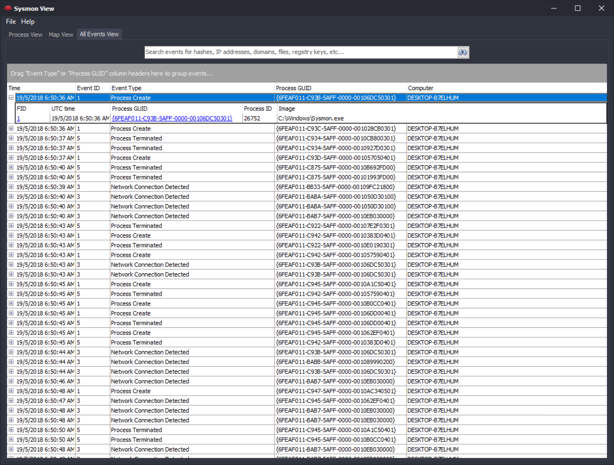
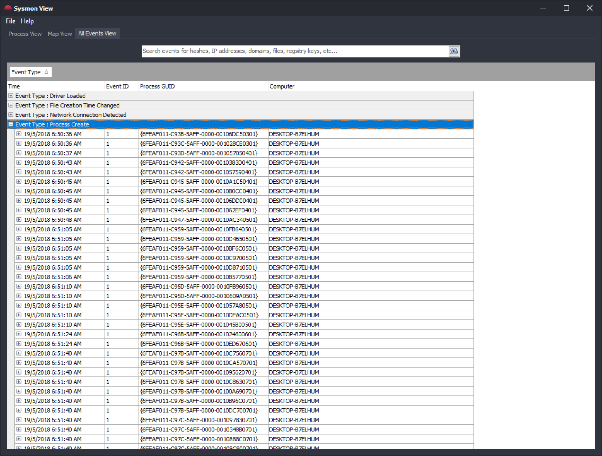
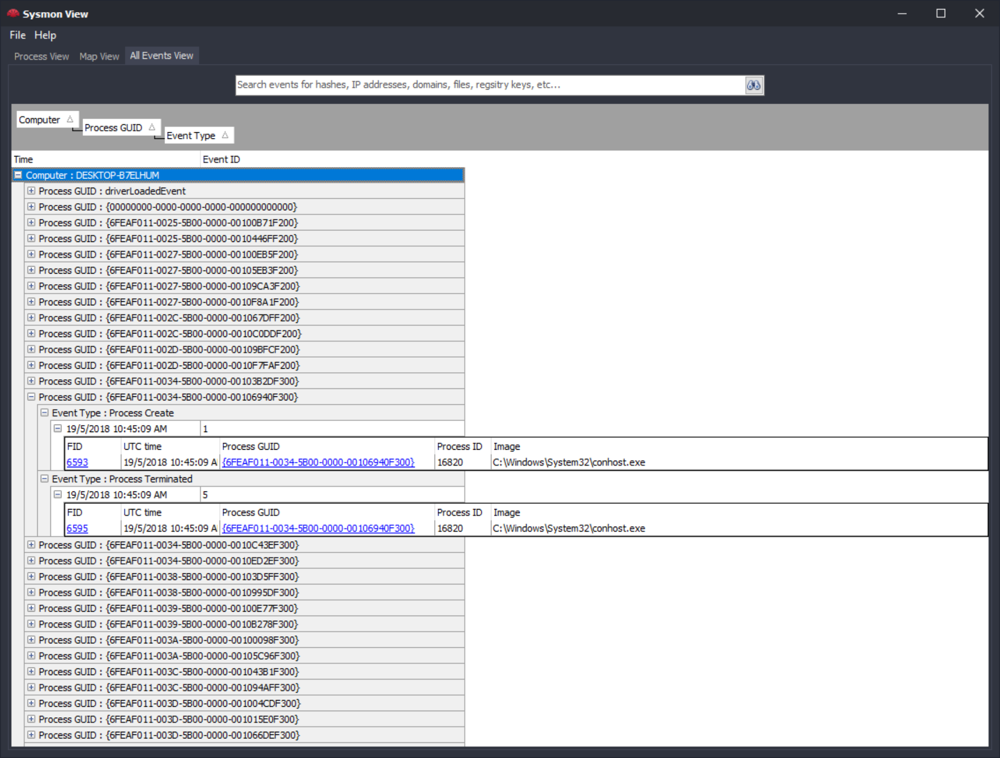
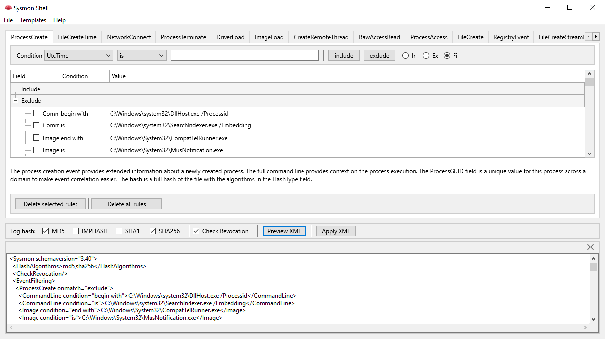
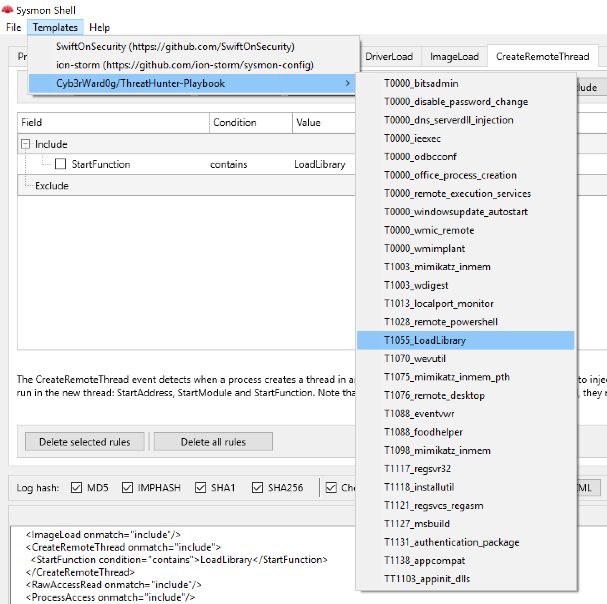
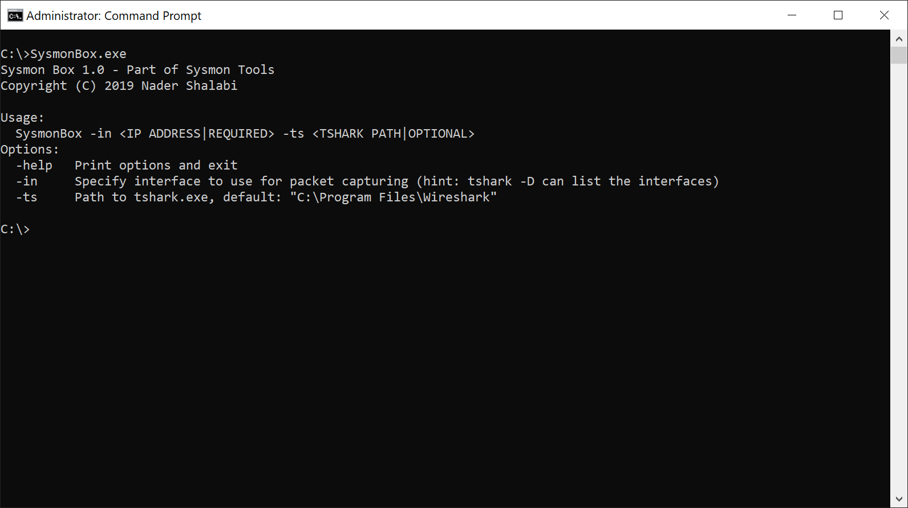

# Sysmon Tools 🛡️

[](LICENSE)


A collection of utilities for analyzing, visualizing, and managing **Microsoft Sysmon** logs — designed for security analysts, DFIR specialists, and threat hunters.

---

## ✨ GUI and Visulaization Utilities for Sysmon

- **Sysmon View** – offline Sysmon log visualization with multiple views, SQLite backend and VirusTotal integration.
- **Sysmon Shell** – GUI configuration editor with bundled templates, export/import options, and XML apply support.
- **Sysmon Box** – command-line utility to capture and correlate Sysmon + network events using `tshark`.

---

# 📑 Content

- [Release Notes](#release-notes)
- [Sysmon View](#sysmon-view)
- [Sysmon Shell](#sysmon-shell)
- [Sysmon Box](#sysmon-box)
- [Additional Resources](#additional-resources)
- [License](#license)
- [Contact](#contact)

---

# 📝 Release Notes

- **Sysmon View:** v3.1 – can import and correlate network trace captures with Sysmon network events.
- **Sysmon Box:** v1.0 – new command-line utility to capture Sysmon and network events.
- **Sysmon Shell:** added command to upgrade configuration files to Sysmon schema v9.0 (temporary solution).

---

# 🔎 Sysmon View

Sysmon View helps track and visualize Sysmon logs by logically grouping and correlating events.  
It uses executables, session GUIDs, event creation times, and more to re-arrange data into multiple **views**.



### Getting Started

Export Sysmon events to XML using `WEVTUtil` and import them into Sysmon View:

```powershell
WEVTUtil query-events "Microsoft-Windows-Sysmon/Operational" /format:xml /e:sysmonview > eventlog.xml
```

- Data is stored in a SQLite database file (**SysmonViewDB**) alongside the executable.
- The DB can be reused or shared; rename it to preserve prior imports.
- The DB also supports direct queries via any SQLite management tool.

### Sysmon Views

- **Process View** – summarizes run sessions (per process GUID) and shows correlated events in a timeline-like flow.
- **Map View** – geo-locates network destinations (via [ipstack](https://ipstack.com)) and pivots into correlated events.
- **All Events View** – full search through collected data, including standalone events (e.g., driver loads), supports grouping by machine, event type, or GUID.








Additional features:

- Double-click any event to access details (e.g., Process Creation, Event ID 1).
- VirusTotal API integration for hash/IP lookups (requires API key).
- Experimental Elasticsearch support for multi-machine imports.

---

# ⚙️ Sysmon Shell

Sysmon Shell provides a GUI to manage and apply Sysmon XML configurations.



Features:

- Load, edit, preview, and export Sysmon XML configuration files (all schemas supported).
- Apply configs directly via `Sysmon.exe -c` (requires elevation).
- Export Sysmon logs with options: export-only, export+clear, or export+backup.
- Descriptions of all event types included (sourced from [Sysinternals Sysmon](https://docs.microsoft.com/en-us/sysinternals/downloads/sysmon)).
- Bundled with community-created configuration templates.



⚠️ **Note:** Sysmon Shell does not validate include/exclude conflicts. Errors are displayed directly from Sysmon output when applying configs.

---

# 📦 Sysmon Box

Sysmon Box is a lightweight utility to build a database of captured Sysmon and network traffic.



### Example Usage

Run Sysmon Box (requires Sysmon + tshark installed and running):

```bash
SysmonBox -in Wi-Fi
```

Workflow:

1. Captures traffic using `tshark` on the selected interface.
2. On stop (`CTRL+C`), dumps packets and exports Sysmon logs for the session.
3. Builds/updates a SysmonViewDB database combining Sysmon logs and traffic.
4. Open the DB with Sysmon View for correlation.

---

# 📚 Additional Resources

- [Sysmon: The Big Brother of Windows and the Super SysmonView](https://www.fwhibbit.es/sysmon-the-big-brother-of-windows-and-the-super-sysmonview)

---

# 📬 Contact

For any customizations or business collaboration inquiries, please visit [applyingcode.com](http://www.applyingcode.com).

---

# ⚖️ License

```text
Copyright Nader Shallabi. All rights reserved.

SYSMON TOOLS CAN BE COPIED AND/OR DISTRIBUTED WITHOUT ANY EXPRESS PERMISSION OF NADER SHALLABI.

THIS SOFTWARE IS PROVIDED BY NADER SHALLABI "AS IS" AND ANY EXPRESS OR IMPLIED
WARRANTIES, INCLUDING, BUT NOT LIMITED TO, THE IMPLIED WARRANTIES OF MERCHANTABILITY AND
FITNESS FOR A PARTICULAR PURPOSE ARE DISCLAIMED. IN NO EVENT SHALL NADER SHALLABI
OR CONTRIBUTORS BE LIABLE FOR ANY DIRECT, INDIRECT, INCIDENTAL, SPECIAL, EXEMPLARY, OR
CONSEQUENTIAL DAMAGES (INCLUDING, BUT NOT LIMITED TO, PROCUREMENT OF SUBSTITUTE GOODS
OR SERVICES; LOSS OF USE, DATA, OR PROFITS; OR BUSINESS INTERRUPTION) HOWEVER CAUSED
AND ON ANY THEORY OF LIABILITY, WHETHER IN CONTRACT, STRICT LIABILITY, OR TORT (INCLUDING
NEGLIGENCE OR OTHERWISE) ARISING IN ANY WAY OUT OF THE USE OF THIS SOFTWARE, EVEN IF
ADVISED OF THE POSSIBILITY OF SUCH DAMAGE.

The views and conclusions contained in the software and documentation are those of the authors and
should not be interpreted as representing official policies, either expressed or implied, of Nader Shallabi.
```
